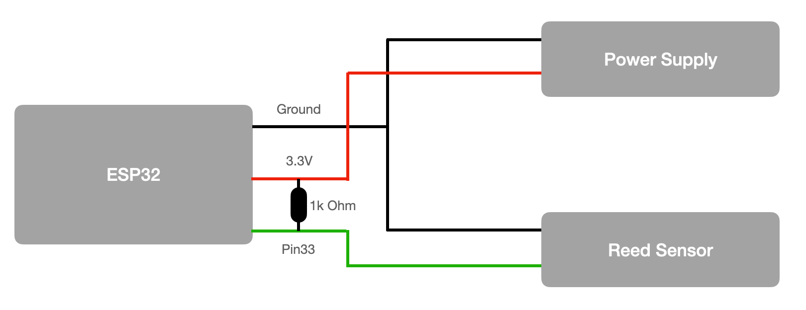

# EspressiShotTimer

Is a easy to build and install espresso shot timer for almost any portafilter coffee machine. I use it everyday with my Rocket Appartamento Espresso machine. It is great if you want to get repeatable espresso shots.  

This project is build with PlatformIO, VSCode and the Arduino framework.

## How it works
The pump in most espresso machines is basically just a motor which produces a magnetic field when it gets power. This can be measured with a reed sensor. 

I wanted to use this effect as it is easy to add a reed sensor to most machines. You can easily glue/tape it to the pump and doesn't need much hardware adjustments or coffee machine knowledge. This makes it feasible for everybody to install this espresso shot timer at home. 
Furthermore, I decided to use an external 5V power supply, as I think it is too dangerous for most users to use the internal coffee machine electricity (230V can be dangerous!).

## What you need
In the following you have a list of suggestions of parts you need to build this project. The total costs for all parts are around 20$.

* Microcontroller with build in LED display: [ESP32 TTGO T-Display](https://www.aliexpress.com/item/33048962331.html?spm=a2g0o.productlist.0.0.b58c2c098F7mfN&algo_pvid=9a81adc2-ce0c-47bb-a4dd-71a462476a64&algo_expid=9a81adc2-ce0c-47bb-a4dd-71a462476a64-10&btsid=0bb0623f16201391171217936ea511&ws_ab_test=searchweb0_0,searchweb201602_,searchweb201603_)
**Note**: I used a special version of this ESP32 with display from Lilygo with pins to the left side. This board can be bought if you contact the seller directly and ask for a custom board. But I think the regular board is also just fine, but you have to change the housing and docking part a bit to connect. 

* Cable connector: [PCB Screw Terminal](https://www.aliexpress.com/item/1000006518504.html?spm=a2g0o.productlist.0.0.753553808svNSN&algo_pvid=null&algo_expid=null&btsid=0b0a556216201400093754778e0179&ws_ab_test=searchweb0_0,searchweb201602_,searchweb201603_)

* High temperature [Reed sensor](https://www.reichelt.com/de/en/-litt-59135-010-p260410.html?r=1)

* Some [Wires](https://www.aliexpress.com/item/4000009001537.html?spm=a2g0o.productlist.0.0.5fd4257fB5iarJ&algo_pvid=1c5f1618-e462-4103-8249-88205578790c&algo_expid=1c5f1618-e462-4103-8249-88205578790c-0&btsid=0b0a555516201388513911642e8ba7&ws_ab_test=searchweb0_0,searchweb201602_,searchweb201603_)
* [Power supply](https://www.aliexpress.us/item/2251832814823467.html?spm=a2g0o.productlist.0.0.10074be6KZ05XQ&algo_pvid=adfc5fdb-c5c5-4d52-aa24-6a72e0842917&algo_exp_id=adfc5fdb-c5c5-4d52-aa24-6a72e0842917-5&pdp_ext_f=%7B%22sku_id%22%3A%2266934215087%22%7D&pdp_npi=2%40dis%21USD%213.57%212.5%21%21%21%21%21%402101d68d16715704109491672e8698%2166934215087%21sea&curPageLogUid=LufYVNifmzBf)  with 3.3V, 1A. Don't worry about the connector, I just cut it off anyway.
* A small [PCB Prototype Board](https://www.aliexpress.com/item/32588853051.html?spm=a2g0o.productlist.0.0.690f190cdSvO5x&algo_pvid=8745a321-eece-4b08-916e-bb816e874ff8&algo_expid=8745a321-eece-4b08-916e-bb816e874ff8-0&btsid=0b0a555916201387423844532e53c2&ws_ab_test=searchweb0_0,searchweb201602_,searchweb201603_)
* 1k Ohm Resistor
* 3D printed housing

## Some Hardware impressions
This is the dock. It has a mini PCB with the two screw terminals and a connector for the ESP32. On the bottom side is a little hole to add a magnet so it better holds on my coffee machine. You can find the .stl file in the CAD folder of this project.

This is the custom ESP32 with display from Lilygo in a housing with the dock (buttons have no function at the moment)

That is how it looks attached to my coffee machine.

## Wiring
The wiring is quite simple. I cut off the connector from the power cord of the 3.3V power supply. The red or white wire is the 3.3V (make sure you get a 3.3V power supply!). This needs to be connected with the 3.3V pin of the ESP32. The ground wires can then be connected as in the diagram below. The last part is to connect one part of the reed sensor with the ESP32 pin 33 to sample if it detected a strong enough magnetic field of a turned on pump. To make sure the PIN is not floating I added a 1k Ohm pull-up resistor from the PIN33 to the 3.3V power line.

The placement of the reed sensor on the pump takes some trial and error as the magnetic field might no be strong enough to trigger the reed sensor at all places on the pump. Below you can see my spot I found works best with my Rocket Espresso machine.

## Code
To code is written for the Arduino framework with the PlatformIo IDE.
I am not using any of the special capabilities (WIFI & Bluetooth) of the ESP32 at the moment.

### What the code does
It samples the reed sensor and as soon as it detects a change it will start the counter. If the reed sensor is active for more than 15sec it counts this measurement as shot that is getting pulled. That means that the display will show the end count for one minute before the display goes back to sleep. This is implemented due to the fact that my machine from time to time activates to pump to refill the boiler  (which takes about 7-9sec) and I don't want to count this as regular shot pulling with activating the display for more than one minute. This doesn't mean that the display is not counting the refilling of the boiler but it switches off the display to sleep immediately after the pump is turned off. 